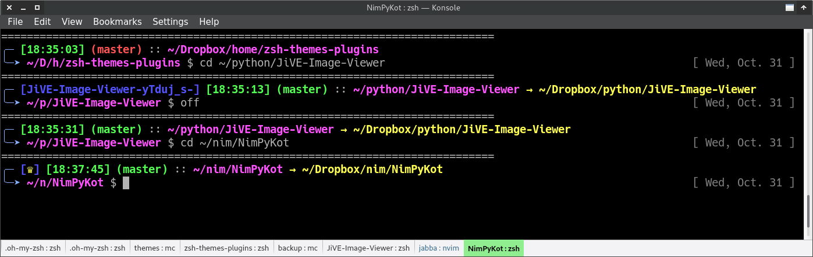
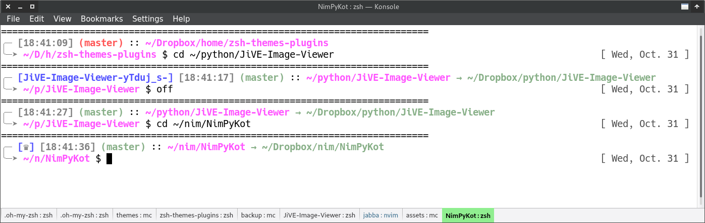
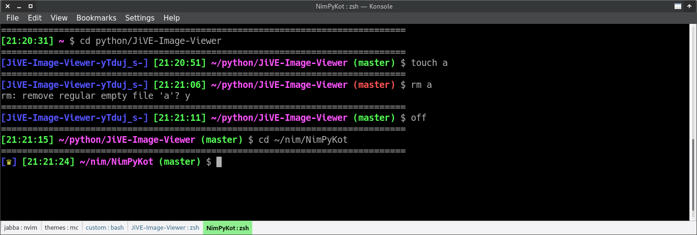
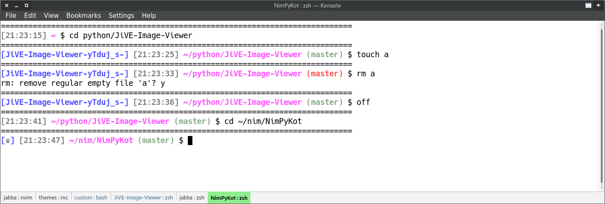
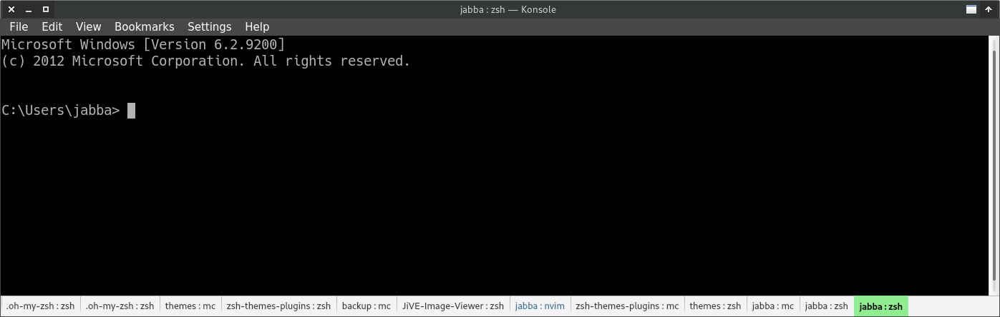

# ZSH Themes & Plugins

Here I collect my ZSH themes and plugins. You can also find here
my `~/.zshrc` file.

For the themes and plugins, you'll need the [oh-my-zsh](https://github.com/robbyrussell/oh-my-zsh)
framework.

## Jabba2 theme

A two-row theme, hence the '2' in the name.

### Dark mode (`JABBA_THEME_MODE="dark"`):

  

This is the default mode.

Here you can see 4 examples.
* First example, first row: time (in 24h format); the git repo is dirty, thus the name
  of the branch is in red; current folder. Second row: shortened current folder (like in fish shell).
* Second example: name of the activated Python virtual environment (if the folder contains a `Pipfile`,
  then the virt. env. is automatically activated with the help of a plugin); the current
  folder is a symbolic link. The real (pointed) folder is indicated after the arrow.
* Third example: the git repo is clean, thus the name of the branch is in green.
* Fourth example: the current folder contains a `.nimble` file, thus the logo
  of the Nim programming language is shown.

### Light mode (`JABBA_THEME_MODE="light"`):

  

Light mode is also supported.

If you have ideas how to improve the look and feel of this theme, what colors to use, etc.,
then let me know.

### Installation

Just copy the file `jabba2.zsh-theme` to your `~/.oh-my-zsh/custom/themes/` folder. The theme
uses three plugins: `virtualenv` (part of the oh-my-zsh framework), `jabba-venv`
and `nim-project`. The latter two plugins can be found in this repository. See my
`.zshrc` file (also in this repo) how to activate the plugins.

## Jabba1 theme

A one-row theme, hence the '1' in the name. This is a simplified version of the jabba2 theme.

### Dark mode (`JABBA_THEME_MODE="dark"`):

  

This is the default mode.

### Light mode (`JABBA_THEME_MODE="light"`):

  

Light mode is also supported.

### Installation

Just copy the file `jabba1.zsh-theme` to your `~/.oh-my-zsh/custom/themes/` folder. The theme
uses three plugins: `virtualenv` (part of the oh-my-zsh framework), `jabba-venv`
and `nim-project`. The latter two plugins can be found in this repository. See my
`.zshrc` file (also in this repo) how to activate the plugins.

## MS-DOS theme

This is a fun little theme that mimics the DOS prompt.

  

### Installation

Just copy the file `msdos.zsh-theme` to your `~/.oh-my-zsh/custom/themes/` folder.
